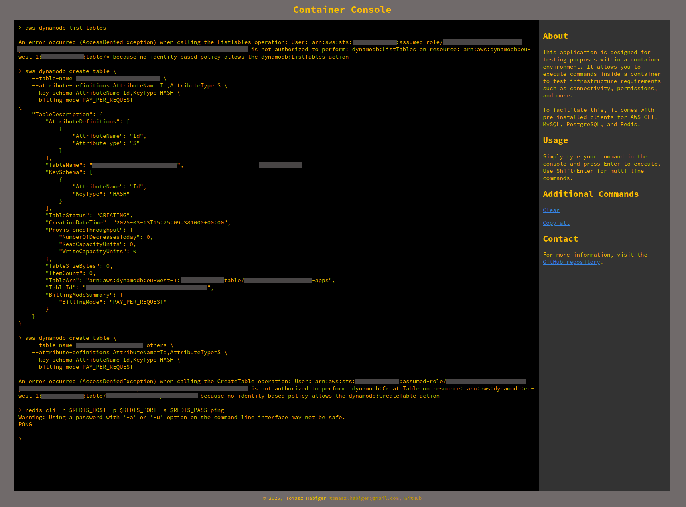

# Web Container Console

Web Container Console is a simple web-based app that lets you run shell commands in real time and see their output instantly. It uses Flask for the web server and Flask-SocketIO for real-time communication.

Designed with testing in mind, it allows you to execute commands inside a container to check things like connectivity, permissions, and more. It also comes pre-installed with AWS CLI, MySQL, PostgreSQL, and Redis clients, so you can diagnose issues without having to set anything up.

If your database seems unresponsive or your IAM permissions won’t let you access S3 or DynamoDB, just spin up this container and run a few commands to figure out what’s going on—no need to poke around in the main app. It’s also handy as a placeholder image when an app isn’t ready yet, letting Ops folks confirm everything is in place before launching.

Keep in mind, Web Container Console is meant for debugging and testing. It’s not intended for production environments.

## Security

By default, the application does not require any authentication to work with. If `SECURE` is set to `1`, users must authenticate using the secret key. The secret may be generated dynamically as a one-time key or be set by the user through the `SECRET_KEY` environment variable. If `SECURE=1` is set but no key was provided, it will be generated as a one-time key at the application start. In this case, you will find its value in the application output - either by checking container logs (standard output) or whatever log management system you have in your environment.

## Usage

Even though the image is meant to be run more in some kind of orchestrated infrastructure, like ECS, EKS, or any other container management infrastructure, knowing how to do a basic Docker run is still valuable when configuring those more specialized scenarios. So here it is:

    docker run -d -p 5000:5000 thabiger/web-container-console

Optional parameters can be passed through environment variables:

    docker run -d -p 5000:5000 \
      -e PORT=5000 \
      -e SECURE=1 \
      -e SECRET_KEY="secret" \
      -e PATH="some/additional/path"
      thabiger/web-container-console

### Detailed steps:

1. Run the Docker image within your infrastructure.
2. Open your web browser and navigate to `http://<deployment_address>:5000`.
3. If `SECURE` is set to `1`, you will be redirected to the login page. Enter the secret key to authenticate(see Security section to learn how to obtain the key). 
4. Once authenticated, you can execute shell commands and view their output in real-time.

## License

This project is licensed under the MIT License. See the [LICENSE](LICENSE) file for details.
